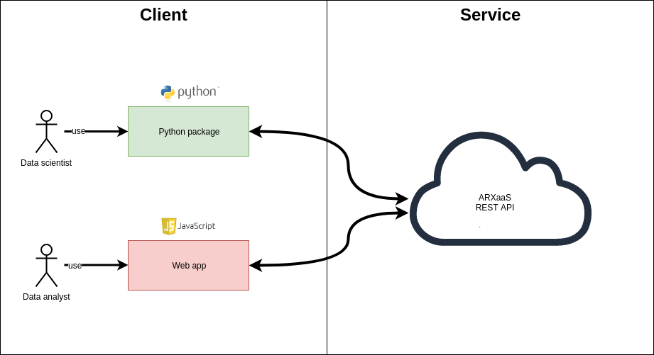

### Front page
### Preface
This chapter is a summary of the product we have developed. It's purpose is to give a short but complete overview of the project background, the product development process and finally the concrete solution developed.

### ToC

### Introduction
The planning for this bachelor project was initiated on the 18.07.2018. After that, the development was officially started on the 08.01.19 and lasted until 06.05.2019. Then, the team worked on this report until the deadline on the 23.05.2019. The solution was deployed on NAV ITs internal platform first 15.april and has been continuously deployed to until the report phase of the project. The team has been working in Oslo, at OsloMet university and NAV IT headquarters in Sannergata 2, four days a week with fixed core work hours nine to four. 

This work could not have been completed without the excellent support from our stakeholders at NAV IT Robindra Prabhu, Paul Bencze, Gøran Berntsen and Erik Vattekar. We also wish to thank NAV IT for trusting us with this important and challenging project, providing us with space to work in, inviting us to present to both internally at NAV and to other public sector agencies such as DiFi and the norwegian tax administration, and lastly for guiding us continuously thorough the process. The team is also grateful for the support from our Bachelor project supervisor Eva Hadler Vihovde.

The terms data and dataset are used continuously throughout the documentation. Unless anything else is specified, the term refers to tabular data/datasets containing population data.

### Presentation of the group
 - Sondre - IT,
 Worked part time for NAV IT AI-lab since fall 2018. Has helped keep the team connected to different project stakeholders in NAV IT. Main competence is Java and Python development, but has worked with web development previously.
 - André as a bachelors degree in machine engineering. Currently finishing a bachelors degree in software engineering.
 Worked as an intern at Aker Solutions prior to studying computer engineering.
 - Julian
 - Viktor
 - Jeremiah has a bachelors degree in machine engineering. Currently studying for a bachelors degree in software engineering. Worked as an intern for OXX from January to May 2019. Main compentence in Java, javascript, C#, MySql.

### Presentation of client
The Norwegian Labour and Welfare Administration (NAV) is the backbone of the Norwegian welfare state, administering a third of the national budget and servicing almost 2.8 million people through a range of schemes such as unemployment benefit, work assessment allowance, sickness benefit, pension, child benefit and cash-for-care benefit. 
In addition, NAV manages and retains stewardship of several important data sources containing information on its users and the services it provides. NAV IT is currently in the midst of a digital transformation, undergoing significant changes in team organization, work processes and harnessing new technologies.
Its use of data in the development of new and improved services is often contingent upon strict data privacy practices and its ability to innovate in a privacy-preserving manner.

Our client for this assignment is NAV IT Data og Innsikt. Data og Innsikt is a department within NAV IT. The department delivers the development of systems and operations of data storage, data processing, data access and analytics.

### Project background
AI Lab is a team within NAV IT Data og Innsikt, functioning as NAV ITs internal knowledge hub in machine learning and data science. One of the areas the team currently is handling is data anonymization. This area presents problems in both the legal and ethical domain, because of its close connection to personal data. 
Data anonymization is a large field with many projects worldwide. There are well established models and algorithms for both anonymization and analytics of data. AI Lab is currently utilizing both internal and external tools for data anonymization. One such tool is ARX, which is widely regarded as top-class anonymization software. ARX is an open source (Apache License, Version 2.0)  project distributed as a GUI application and as a Java JAR library. It is prominently used by large organizations to anonymize health and patient data.

ARX contains a large and powerful amount of functionality for data anonymization, but the interaction with said functionality is limited to either interaction with the GUI application or programmatically with the Java API provided by the JAR. Neither option is well suited to NAVs data scientist or their workflows. 
Data science today is typically conducted within programming languages like Python and R. The data scientist develops scripts, notebooks and larger programs for extracting and analyzing data. Early stage tasks typically include data cleaning and data transformation. Anonymization may be viewed as such a data transformation task, but ARX currently does not integrate seamlessly into the typical Python/R-based data science workflow. 
Moreover, while ARX provides functionality and flexibility for a skilled user, the front-end arguably requires knowledge of technical concepts and methods in anonymization above and beyond that of the typical developer and which requires a non-trivial investment of time to learn and understand.

The AI-lab has therefore requested the group to:
- Provide access to ARX functionality from modern data science toolsets and workflows

- Provide an extendable framework for making state-of-the-art anonymization methods accessible to a wider audience in NAV IT by lowering the barriers to use.

#### De-Identification
Following is a short description of de-identification. For more in-depth explanations see the chapter De-Identification.

De-Identification is a common term for reducing the probability that a person can be identified from a dataset containing *personal identifiable information* otherwise known as PII. transforming dataset containing PII into aggregates is a common method to de-identify the data, but this result in high levels of information loss and hinders other researches from verify the aggregate or do additional research on the raw data. De-identification permits sharing and using datasets containing PII by transforming the data util it can not longer be classified as PII.

There exist several models and algorithms for both quantifiable assess the disclosure risk for a given dataset and anonymize a dataset until it meets required risk thresholds. ARX[https://arx.deidentifier.org/] is a state of the art software tool[https://www.ncbi.nlm.nih.gov/pmc/articles/PMC4419984/] in this space, and is used widely by medical researchers to anonymize patient datasets before releasing it to the wider research community. It implements a variety of models and algorithms and is continuously being improved and updated.

#### Current situation

Much of the literature, practices and frameworks in the de-identification space are targeted for distribution of medical data between researchers. NAV has a similar use case, but different in that the organization primarily is concerned with internal reuse of data. Every new usage of PII data in NAV has to go trough a Data Protection Impact Assessment or DPIA[https://www.datatilsynet.no/regelverk-og-verktoy/veiledere/vurdering-av-personvernkonsekvenser/]. This means that data scientist working in NAV AI-lab that wants to research a new possible use for some data has to go trough a lengthy assessment just to be able to inspect the data. A lot of time is spent on getting the necessary access to be able to do preliminary assessments of data. Often the data is gauged to be insufficient and the time spent on the DPIA is more or less wasted. If the data was anonymized the process could be sped up. In addition it would open up new possibilities for sharing and reuse of data internally at NAV. The data driven revolution is in full swing all around the world[https://dzone.com/articles/what-it-means-to-be-a-data-driven-enterprise-and-h]. Core to the data driven enterprise paradigm is the sharing of data internally in the enterprise. Making anonymization easier would put NAV in a better position to become more data driven and by effect provide better services to their users (Every inhabitant of Norway).

There are several products in the anonymization/de-identification space. But the tools fall mainly into two categories: 
 - Proprietary solutions that works as a "walled garden" with limited integration with other tooling
 - Open source projects built by and for researches

 Common to both categories is the fact that most solutions are mainly focused on Graphical user interfaces. There is limited support for integration and further development.

### The solution - Anonymization as a Service
Anonymization as a Service refers to the group of products that make up the Anonymization as a Service ecosystem. The center piece of this ecosystem is the microservice named ARXaaS or *ARX as a Service*. ARXaaS is named after ARX, the team felt it was appropriate to show homage to the great work the ARX team has done. Without ARX being open-source and available for extension this project would not be feasible. Additionally to ARXaaS there are two clients named PyARXaaS and WebARXaaS. These products provide integration with ARXaaS from a Python context and as a Web application.

#### Solution description
Anonymization as a Service provides access to anonymization tools propose made for data scientists at NAV IT. A data scientist is able to analyze and anonymize tabular dataset based on user-provided configurations. The user can configure privacy models, attribute types and transformation models(hierarchies) to use in the anonymization. A common use case would be in a workflow where the data scientist is manipulating a dataset, and requires dynamic analysis of the data anonymity metrics. Another use case could involve integrating the system in a data pipeline to provide data analytics and anonymization capabilities.

##### System diagram

*Figure 1 - System diagram*

As the system diagram shows the system consists of three(so far) separate systems.

- ARXaaS - the anonymization microservice
    A Java Spring boot microservice which utilizes the [ARX](https://arx.deidentifier.org/) de-identifier library to expose functionality in three key areas
     - Dataset re-identification risk analysis
     - Dataset anonymization
     - Generation of generalization hierarchies
- PyARXaaS - the wrapper package
    A python wrapper package for NAVs data scientist. The main requirement the teams product owner at NAV was that the anonymization functionality was made available in Python. This package abstracts the REST calls to ARXaaS and provides a easy to use API for the data scientist to analyze and anonymize their datasets.
- WebARXaaS - the stretch goal
    The project stretch goal. The product owner was clear from day one that the python package was the main priority of the team. But there are other user groups for anonymization at NAV. User groups without the required experience with programming to use a Python package. For this user group a simple to use web application where they could perform analysis and anonymization would be practical

These three products for the Anonymization as a Service ecosystem. The core functionality is the responsibility of the ARXaaS application. While the clients PyARXaaS and WebARXaaS provide user specific interfaces. A core idea behind the microservice design is to create a anonymization platform where lightweight clients would integrate the functionality in new and unique contexts. The team has implemented a Python client package and a web application but the room for further development and integration is wide open. And as the whole team has been hired as for a summer internship to continue the development we are confident the current solution and feature set is only the beginning.

#### Deployment
The team developed in a complete CI/CD pipeline for the different  components using the Travis CI platform. As the client wished that the finished product could be deployed to NAVs internal container orchestration solution Nais[https://nais.io/], the team setup a testing Kubernets cluster to continuously deploy to in the first sprints until the product stabilized and deployment moved to Nais in mid of april.

The pipeline is described in closer detail in the development process. But the team feels strongly that the continous integration pipeline has been instrumental to the project success. When a commit is merged to the master branch[https://git-scm.com/book/en/v1/Git-Branching-What-a-Branch-Is] for the main service goes through the following steps before it is deployed to the Nais platform. If there is any failures the deployment is stopped and the team is notified.

- Test

    The full test suite is with unit tests, integration tests and system tests are ran.

- Documentation

    API documentation for the HTTP endpoints are generated and automatically tested. This documentation is a combination of human written text and auto generated snippets of information about the various endpoints, accepted HTTP verbs, request and response body JSON structure.

- Packaging

    The service is packaged in different artifacts with different formats for the deployment and artifact hosting platforms. Main artifacts being Java JAR and docker.

- Publishing

    The packaged artifacts are deployed to different platforms and hosts. 
    - API Documentation is pushed to Github pages
    - Docker container is published to dockerhub
    - Source, Javadoc and class JARs are signed and published to maven central

- Deployment

    After a new deployment has been completed both the teams internal Kubernetes cluster and NAVs Nais platform deploys the new service version.

Having a complete CI/CD setup from essentially day meant the team was continuously gathering feedback on the product. It meant the client could use the features implemented as they where implemented and most importantly it meant the team had real-time information on the stability of the product.

### Conclusion

During the development of Anonymization as a Service the team learned and utilized a variety of new technologies. Experienced professional product development in a whole new domain (de-identification/anonymization). A domain which puts a high premium on reliability and correctness. The team feels strongly that the have delivered on the requirements presented by the client back in January. The team has developed three separate technical products in synchronization with feedback from the customer. The success of the project was marked with a summer internship contracts from NAV IT for all team members the summer 2019. The team will during the summer focus on the further development of the product.

### References
personal data: https://gdpr-info.eu/issues/personal-data/

### Word list

- Equivalence class

    Records in a dataset that have the same values on the quasi-identifiers.

- PII

    PII or Personal Identifiable Information is any data that can be used to clearly identify an individual. 

- Nais

    NAIS is an application platform built to increase development speed by providing our developers at NAV with the best possible tools to develop and run their applications. url: https://nais.io

