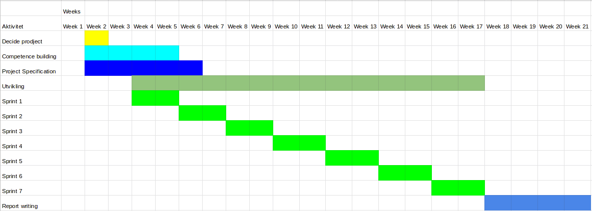

### Front page

### Preface

### ToC

### Introduction

This report contains the work done in this bachelor project that led to the final result. The project planning started 18.07.2018 and the bachelor project started 08.01.19 and lasted to 23.05.2019. The team has worked at Oslomet university in Oslo and NAV IT headquarters at sannergata 2 in Oslo. The team has worked together four days a week with fixed core work hour's nine to four. These days the team have worked together as a group, where they have worked on there assigned sprint tasks as well as made important project decisions. In addition to this all team members have worked from home as well.

In the course of the project period the team has had close contact with the product owner Robindra at NAV IT. In the first meeting with the product owner the minimal viable product was decided. The system should anonymize a tabular data set based on the user’s desired anonymity level with a minimum of K=4 anonymity. This functionality was to be delivered in a Phyton client. As a stretch goal the  product owner and the team wanted a WEB application.

This document starts with the teams planning and development methods......
#[need more]

### Planning and methods

This chapter will explain the creation of the team and planning of the project as well as the planning during the project. The chapter starts with development methods applied by the team. Followed by project phases and the project conclusion and documentation.

### Development methods

Our approach was to deliver a minimum viable product and the deliver small features as increments in order to always have a running application. Close contact with the product owner was always a high priority to make sure that the product was developed to his requirements and needs.

#### Agile work process: [https://agilemanifesto.org/]

The team decided to use a agile work process with our product owner's demands and wishes as our top priority. The team worked in to week sprints. At the start of every sprint the team did sprint planning and chose the user story's to add to the sprint backlog. The team then added the user storys chosen for the sprint to our Khanban board in Asana. The team members chose or assigned the different tasks as a group. A definition of done was specified for each sprint by the group. An example of this was every feature had to be tested before merging into the master branch. During the each sprint the team had daily scrum meetings to keep the rest of the team updated on each individuals progress as well as to share knowledge in the team. At the end of the sprint the team had a sprint retro meeting where each member made post-it notes labeled start, stop and continue. The start post-it notes where suggestions of items to be implemented in the next sprint. The stop post-it notes where things that had not worked well for the team or an individual. The continue post-it notes where items that worked well in the sprint and the team member wanted to keep doing in the next sprint. The project was divided in to seven sprints with a duration of two weeks where we presented the new features to our product owner at the end of each sprint. Then based of the feedback from the product owner the team created new user story's and definition of done for the next sprint.

#### Continues integration pipeline

The team decided early in the process to set up a CI pipeline to automate tests and deployment.
Every time a team member pushed a commit to our version control host Git . Travis testes every branch in a virtual environment before it can be allowed to be merged into master branch. If the job passes all test. It can be merged into to master branch providing it passes Code climate static code analyses test and SNYK vulnerability tests. After a team member approves the code review the branch is merged into master branch. Travis then deploys docker container to Google cloud and the NAV IT nais platform. Before deploying JAR and javadoc to Maven witch then hosts are Javadoc.

#### Test driven development

In the teams definition of done it required tests to be made and passed for all features. This had to be done before merging into master branch. This worked well for the team and we ended up with 90% plus test coverage.The team also used Linter in the team members IDEs to make sure the code was clean.

#### Code reviews

In the planning process the team decided to use Git as version control. After Travis,Code climate and SNYK test passed a team member had to review the pull request. A team member had to read and approve the code before a merge to master branch could be done.

#### Feature slicing

The team worked actively on slicing up big features requested by the product owner into smaller features. After slicing the features. The team evaluated the different features and decided with the product owner which features where best to implement first. This made sure that the product owner got features delivered fast. Deliverys where made in small increments that provided the most value as fast as possible.

### Project phases

#### Initiation

 The project started with a get to know meeting at Starbucks in Torgata 18.07.2018. Everyone discussed their expectations for the project and the way forward. Sondre had a contact person at NAV IT and had talked about a possible bachelor project with them. Our contact person at NAV IT had mentioned key words such as Kafka, docker / kubernetes, Java, Python,data lakes, data virtualization as possible things we can work with. During this meeting It was also suggested to recruit a fifth party to the group. The group then contacted Viktor and asked if he wanted to join the team. After a second get to know meeting Viktor joined the team. 
 
 #### Planning

 The team in Norway Sondre, André, Viktor and Jeremiah had a meeting with NAV IT while Julian was studying abroad. This information meeting was with Tommy and Gøran. In short, the goal was to build a "pipeline" from raw data that NAV sits on and make available to stakeholders outside NAV (media, private persons, etc.). The pipeline was to accommodate the entire range from integration with raw data systems at NAV, to visualization and typically front-end solutions. The product that NAV's Open Data project was to deliver is a common platform / toolbox for delivering open data to the Norwegian population. The idea was that the team will deliver a contribution to this project. The team must be involved in developing the plan for the specific product we are going to deliver, but it will be within the Open Data project framework. Concrete features in the Open Data project that the team could participate in was, API - backend pipeline , Portal - web platform (data.nav.no) and Meta-data system for for automatic generation of visualizations . The team was given some task to complete before january 1st 2019. Every team member had to read the Accelerate book. And the team also where asked to get to know Docker and Kubernetes. Further more the team was asked to brainstorm ideas for solving “How can NAV deliver specific data sets they are sitting with, in a good and user-friendly manner (user-friendly for developers, media houses, private persons)". A purposed idea was to focus on a specific data type and expand it eventually if the solution is good or if there was time to improve the solution. The initial idea was to focus on treatment time. What kind of issues take the longest time  and shed light on treatment time. The goal was to streamline assessment of departments time spent on treatment. At 18.10.18 the team had it's first meeting with Eva Hadler to talk about guidance for the bachelor project. Eva was highly recommended and the teams was happy she decided to be the supervisor for the project. Eva shared her experiences with undergraduate projects and what was expected. The team had a sync meeting 23.10.18 and got Julian up to date on what the team had done in Norway. After a couple of meetings discussing frame works and tools the group had there first bachelor meeting in 2019. The team decided on regular workdays and hours. The team decide on to work with Github, Asana, Travis and Slack.  At  this point the project task was still a bit in the air. At are next group meeting at NAV IT. Robindra and Paul  presented the data anonymity project to the team. The essence of the project was to make Arx's functionality available to NAV's systems and build a framework that makes Arx's anonymization functionality available to NAVs data scientist. The sought after functionality where, being able to submit data sets to the service and receive an anonymized data set of the desired anonymity level. The group discussed different approaches to the problem and tools we can use. Tentatively the team planned an overall architecture with Java / Spring backend and Python / Jupyter Notebooks, Javascript / React frontend and Docker as scalability. The group agreed that this was a good project with both enough content and room for stretch goals.  At the next meeting 10.01.19 at NAV IT Robindra gave the team an introduction to ARX. The team decided on a English working language for documentation and code to make the open source project available to everyone. Robindra got the title as product owner and Sondre got the title as Scrum master.The team decided to work in to week sprints. It was decided to use seven sprints for development of the application and for weeks to write the project report.

#### Execution

The project lasted from 08.01.2019 to 23.05.2019 and ended with a presentation on 14.07.19. During this time the team had workshops and presentations for the NAV IT staff as well as a presentation for the Agency for Public Management and eGovernment (Difi). The applications was put in to prod at NAV IT and is now running on the Nais platform, Google Cloud and hosted by Maven. The entire group was offered summer internships at NAV IT to continue development of the applications and all team members said yes.

### Project conclusion and documentation
 
The applications handover took place at NAV IT headquarters at 26.04.2019 after this the team worked on the project report as well as online documentation and user manuals until delivery 23.05.2019.

#### Planning tools
The team decide early to use Asana[https://app.asana.com/] for sprint planning and project management. The sprints were divided in Backlog, ToDo, In progress and Done. This was displayed in a Khaban board in Asana and allowed all team members to see each team members tasks and progress. The larger backlog items where divide in to smaller subtask where each subtask was assigned to a team member. The tasks also had notes on possible solutions or programs to use for completing the task. After each sprint retro meeting with the product owner the team created a new user story's and task for the backlog. During sprint planning the team decided witch task to bring to the new sprint as well as team members assigned to the task. The team tried to keep the task and features small enough to be completed in one sprint. To get a overview of the entire project the team created a Gant diagram. The Gant diagram was a greet tool to keep track of the sprint and the time left for the project. 

### Competence building

The team used the first two weeks of the project to make the pre-project report and decide witch software tools,software languages, and working methods to be used in the project. After this the team got all computers updated to the same version of software before starting group education. The group used the Pluralsite [https://www.pluralsight.com/] Scrum course to get all members up to date on Scrum as well as to make sure the team had the same understanding of Scrum. The team had a solid Java programing base but needed to learn more Phyton programming. Sondre held a Phyton programming course for the rest of the team to accelerate the Phyton programming skills of the group.

# [need more]

### Budget

The budget for the project was 200 Nok for the Google Cloud. The teams software was student licensed or free to keep the cost of the project to a minimum.

### Development process

#### Challenges met and choices made

#### Descriptions of the sprints

The team worked in two week sprints and used seven sprints to complete the application. There was also a sprint 0 before the team started work on the application. This chapter has detailed descriptions of the sprints. Each sprint is divided into Sprint Duration,Summary, Backlog, Goals, Sprint Review and Sprint retro.

#### Sprint 0

Duration: Monday 07.01.19 - Friday 18.01.19

#### Sprint 0 Summary:

The team finalized the project assignment with NAV IT and started working on writing the pre-project report.  

Created a repository in the version control host Github,  where the team members can start experimenting and exploring the ARX library.  Created a repository in the version control host for the service and started preparing the REST controller. 

Created the project webpage. 

#### Sprint 0 Backlog: 

- [COMPLETED] Finalize the project with NAV IT 

- [COMPLETED] Write the pre-project rapport 

- [COMPLETED] Create ARX Playground project for Testing and exploring the ARX core library. 

- [COMPLETED] Create Java Spring boot repository on Github for development of the service 

- [COMPLETED] Publish the project webpage 

#### Sprint 0 Goals: 

- We did not create any sprint goals for this sprint 

#### Sprint 0 review: 

The team finalized the project with NAV IT. The team did group education in Scrum and Phyton programming. As well as completing the entire backlog.
The team presented the pre-project rapport to Eva the teams Bachelor thesis supervisor. Eva approved the teams pre-project rapport, but pointed out important areas of improvement for the final rapport.

   - Provide reasoning for technical and non-technical choices 

  -  "Tell the story about the project" through the documentation 

Eva also provided guidance for the requirements document the group has to finalize by 20.01.19 

 - Which demands are from NAV and which demands have the group formulated. 
#### Sprint 0 retro:

In this first unofficial sprint we did not do a sprint retro.

#### Sprint 1

Duration monday 21,01.19 - friday 01.02.19 

#### Sprint 1 Summary:

Started working on implementing the continues integration workflow on both the service and client repository in the version control host Github. Began with implementing a feature to anonymize a dataset with a k-anonymity privacy model. 

Finished implementing the spring controller class in the service, and started to build a docker image and published the service to google container registry. 

#### Sprint 1 Backlog: 

- [COMPLETED] Implement python wrapper API for k-anonymity 

- [COMPLETED] Implement Spring Controller class in the service 

- [COMPLETED] Build service in a docker image 

- [COMPLETED] Publish AaaS backend docker image to Google container registry 

- [COMPLETED] Setup travis for PyAaaS 

#### Sprint 1 Goals: 

In sprint 1 we defined this definition of done (DoD) as part of our Sprint: 

- Unit testing implemented: 

     - Coverage for normal case 

     - Coverage for sensible edge cases 

- Testing running in Travis 

- JavaDoc on Classes and methods 

- Code Review completed, min=2 

- Code is complaint to linter 

- Code complaint to Static code review 

#### Sprint 1 review

Participants: 
- Robindra 
- Gøran 
- Sondre 
- André 
- Viktor 
- Jeremiah 
- Julian 

Delivery: 

https://github.com/OsloMET-Gruppe-8/PyAaaS/releases/tag/Release-0.0.2 

AaaS 

The team presented the delivery from Sprint 1.  A Python wrapper package and Spring boot backend for ARX functionality. The current feature set is anonymization of data ( pandas.DataFrame, csv string) with k-anonymization. 

Feedback from Product owner: 

The delivery for sprint 1 has delivered to expectations. The choices regarding the public api exposed by the python package was approved. 

Requests for the next Sprint:

(Not ordered by priority)

 - Implement deploy pipeline to Nais platform 

-  Implement support for L-Diversity Privacy Model 

- Documentation and example cases for non-experienced users 

- Implement Hierarchy Generator 

- Create NAV/Norway specific Hierarchies 

- Return metadata from anonymization with the anonymized dataset 

- Provide easy integration for datapackage metadata format and metadata from anonymization 

- Provide continuous feedback to user when completing subactions with Python wrapper 

#### Sprint 1 retro: 

Good ot ordered by priority: 

- Good first increment from sprint 1 

Challenging 

- Frustration with new technologies 

- Challenges with work documentation in Agile process 

- Time for learning 

#### Sprint 2

Duration monday 04,02.19 - friday 15.02.19 

#### Sprint 2 Summary: 

The team started working on implenting a new features , anonymizing a dataset with a L-diversity privacy model and receiving a re-identification risk profile when analyzing a dataset.  

The team started working on creating a javadoc for the service. 

Created a feature in the client where the different settings to be used to anonymize a dataset is shown before being sent to the service. 

#### Sprint 2 Backlog: 

- [INCOMPLETED] As a data-scientist, I would like to retrieve analytics of re-identification risk for my dataset. 

- [INCOMPLETED] As a data scientist I would like to be able to use L-Diversity as a Privacy Model for my dataset. 

- [INCOMPLETED] As a user of the system, I would like java-docs for easy functionality lookup. 

- [COMPLETED] As a developer using PyARXaaS I would like to receive information about the configurations about my anonymization payload before I run the anonymization process. 

#### Sprint 2 Goals: 
 
Test Coverage_

- AaaS test coverage 55% 
- PyAaaS maintain 80 % 
- PyAaaS Increase unittests vs integration tests 

Documentation 

- AaaS Javadoc:

    - All Classes 

    - All Controller methods 

    - All Service methods 

    - All ARX util methods 

- PyAaaS docstring 

    - All classes 

    - All class methods 

    - Complex internal functions/methods 

    - public functions 

- Refactor and reduce Technical debt 

    - Split ARX wrapper in classes 

#### Sprint 2 review 

    Started working with implementing javadoc. 

    Started back-end implementation of analyzing against re-identification risk. 

    Started back-end implementation of l-diversity risk. 

    Implemented functionality to programmatically display information from my request object in the frontend. 

    Started implementing maven deployment and generation of PGP-keypair. 

 

#### Sprint 2 retro: 

Completed 18.02.19 

We timeboxed 1 hour monday to complete Sprint Retro for Sprint 2 (week 6-7) 

Concrete improvements: 

-Every project member is responsible for writting a short summery of their day in the project diary 

-We schedule a debrief meeting (10 mins per member) before each Sprint Review for sharing of concrete features they have worked on 

-We will make ourself availibe for the PO(Robindra) atleast one day a week 

 

Good:  

- Fun at work
- Independent working 
- On schedule - right amount of work
- Good increments
- Good motivation for work 
- The team is good at giving feedback  
- Stabile and good progression
- Good cooperation and sharing of knowledge
- Good teamwork when taking decisions
- The team uses Scrum well
- Good attendee's = 100%
- Good cooperation when developing solutions
- Realistic expectations

Improvements:

- Avoid blocking tasks
- Splitting in group of skills - risk of isolation
- Team members are arriving late for work in the morning
- Lots of interruptions
- Time is used for other school work meant for bachelor work.
- Challanges with Python skills
- Get better at proposing improvements to the entire team.
- Improve focus in time boxed events
- Improve effort in writing reports
- Improve handling of blocked task
- Improve focus on product owner

#### Sprint 3

Duration monday 18.02.19 - friday 01.03.19 

#### Sprint 3 Summary:

Finished implementing the analyzation feature for the service and client. Finished implementing the different L-diversity privacy model for the service. Continued to work on more documentation for the javadoc.  

Started working on implementing a feature in the continues integration pipeline, to build a docker image of the service and publishing it to the google cloud repository. Started exploring the possibilities on implementing a feature for global value generalization as a transformation scheme. 

#### Sprint 3 Backlog:

- [INCOMPLETED] As a data scientist, I would like to be able to set a global value generalization as my transformation scheme for column field. 

- [INCOMPLETED] As a data engineer supporting the ARXaaS service, I would like to be able to deploy the service to a docker container environment. 

- [COMPLETED] As a user of the system, I would like java-docs for easy functionality lookup. 

- [COMPLETED] As a data scientist, I would like to be able to use ℓ-Diversity as a Privacy Model  for my dataset 

- [COMPLETED] As a data-scientist, I would like to retrieve analytics of re-identification risks for my dataset. 

#### Sprint 3 Goals: 

- Test Coverage: 

    - AaaS test maintain 80%+ 

    - PyAaaS test maintain 80%+ 

    - create AaaS intergration tests for new and old functionality 

- Documentation: 

    - AaaS Javadoc 

        - All Classes 

        - All Controller methods 

        - All Service methods 

        - All ARX util methods 

  -  PyAaaS docstring 

        - All classes 

        - All class methods 

        - Complex internal functions/methods 

        - public functions 

Goals from sprint 2:

- Every project member is responsible for writing a short summery of their day in the project diary. 

- We schedule a debrief meeting (10 mins per member) before each Sprint Review for sharing of concrete features they have worked on. 

- We will make ourself available for the product owner(Robindra) at least one day a week 

- Refactor and reduce Technical debt 

  -  Split AaaS ARX wrapper in classes 

  - Split PyAaaS  

  -  AnonymizationPayload class 

#### Sprint 3 review 

Implemented the feature to retrieve analytics of re-identification risks for the dataset 

Implemented generation of javadoc in maven and automatically deploy it to an online service for hosting using travis. 

Split the ArxWrapper back-end class into modules. 

Fully implemented the use of L-diversity and its variants. 

Successfully deploying to maven central with along with the  javadoc. 

Generated PGP-keypair and encrypt all the jar-s and pom file upon deployment. 

Sonatype authentication upon deployment. 

#### Sprint 3 retro 

We are going to keep concrete improvement from the last sprint. This has worked well for the group and the product owner. 

Every project member is responsible for writting a short summery of their day in the project diary. 

We schedule a debrief meeting (10 mins per member)before each Sprint Review for sharing of concrete features they have worked on. 

We will make ourself available for the Product owner(Robindra) at least one day a week. 

#### The group did a Start-stop-continue session 

Where each team member writes down at least one thing for each the three categories. 

#### Start doing: 

- If we have to change workplace or time. Try to do it in daytime the day before 

- Start documenting completed features 

- Star increasing documentation frequency? 

- Python course? 

- Start focus on building features 

#### Stop doing: 

- Stop coming a little late 

- Stop overestimating how much we can do in a sprint 

- Stop late meeting changes when we don’t need to. Try do it in the daytime 

- Stop assuming that  someone else will fix it 

#### Continue doing: 

- Continue being open and helping each outer 

- Continue working dynamically 

- Continue planning daily schedules 

- Continue Planning daily schedules  

- Continue showing up at time 

- Continue with good moral 

- Continue daily individual project diary  

- Continue to find errors 

- Continue to take care of each outer 

- Continue to keep product owner in focus 

#### Sprint 4

#### Sprint 5

#### Sprint 6

#### Sprint 7

#### Development tools

#### Lessons learned during development

### Product specification

#### Main Specifications descriptions

Process

The development team will use the SCRUM framework to organize tasks, work, and project progress.

Functional demands

Backend
The system should anonymize the data based on the user’s desired anonymity level
The system should be able to evaluate the anonymisation level of a given data set
Frontend
The Python package should support standard visualisation of the results.

Non-Functional demands
Backend
Platform: Docker/Nais/Kubernetes
Runtime: Java/JVM
Framework: Spring

Frontend (Consumers)
Python package
Javascript (websites)

- Stretch goals descriptions

Javascript (website)

- Delivery

### Closing 

### Sources

https://agilemanifesto.org/
https://www.pluralsight.com/
https://app.asana.com/