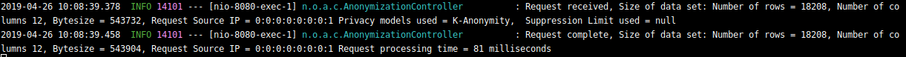
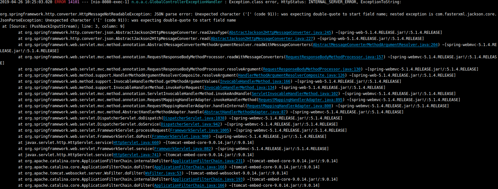

### Front page

### Preface

### ToC

### Introduction

### ARXaaS REST web service

- Short presentation
- Technologies
- Functionality

Logging:

ARXaaS has logging implemented using log4j. For every data set that is analyzed and anonymized. The application provides metrics for received and completed requests. The log displays the size of the dataset, number of rows and columns, source IP, dataset bytesize, privacy model used, suppression limit and request processing time.



In the case of an error or exception a full stack trace is printed to make debugging faster and more efficient.



- Security/https settings
- Open source license

### Client side introduction

- PyARXaaS
- Short presentation
- Technologies
- Functionality
- Open source license

### WebARXaaS

#### Short presentation

As a stretch goal, the employer wished for a way to quickly access the ARX functionality. It was therefore decided to implement an interactive web frontend, by taking advantage of the flexible REST API provided by the ARXaaS service. Making this client available will give the user the posibility to analyze or anonymize their data, without the need to install software on their local machine.

#### Technologies

The interactive Web service is implemented in React using multiple third-party frameworks in order to provide the best possible service

| Package     | Use                                                                                                                   |
| ------------| --------------------------------------------------------------------------------------------------------------------- |
| React       | React is a library for building interactive web user interfaces. It simplifies rendering content on the website and lets us split our code into many single-purpose components. |
| React-BootStrap | Open source toolkit for making flexible interfaces adaptable for a wide range of screen sizes including mobile phones. And gives the website a professional looking color scheme. |
| Papa Parse  | Powerful tool for parsing and building CSV files with JavaScript                                                      |

#### Functionality

All the functionality can be accessed through a single page application.
Where the two main functionalities is *analyzation* and *anonymization*.

##### DataImport

The data import step is mandatory whenever the user wish to analyze or anonymize the data.
To load data the user clicks the load button, and selects a *CSV* file.
Once the *CSV* file is loaded, a automatically generated section will be displayed, showing each of the attribute headers from the csv file below the data import area.

##### Analyzation

The analyzation feature requires that the user already has loaded a *CSV* file, and set the correct *attribute types*.
By pressing the *Analyze* button, the website will make a call to the backend service on `/api/analyzation` containing a JSON formatted payload, containing all the loaded data together with metadata.
Once the response is received back from the service it will render multiple tables bellow containing metrics describing the analyzation quality.

| Metric table          | Content                                                                                             |
| --------------------- | --------------------------------------------------------------------------------------------------- |
| Reidentification risk | Contains percentage likelihood on various *re-identification risks*                                 |
| Risk interval         | Gives metrics on how large portions of the entries in the data which is affected by each risk range |

#### Anonymization

The anonymization feature requires that the user already loaded a *CSV* file, set the correct *attribute types*, and uploaded a *CSV* file containing a generalization hierarchy/transformation model for each of the *quasi-identifying* attributes.
By pressing the *Anonymize* button, the website will make a call to the backend service on `/api/anonymization` containing a JSON formatted payload containing all the loaded data together with metadata.
Once the response is received back from the server it will display tables containing the following tables.

| Metric table          | Content                                                                                             |
| --------------------- | --------------------------------------------------------------------------------------------------- |
| Anonymization data    | The anonymized version of the dataset                                                               |
| Reidentification risk | Contains percentage likelihood on various *re-identification risks*                                 |
| Risk interval         | Gives metrics on how large portions of the entries in the data which is affected by each risk range |
| Process time          | The time spent by the backend anonymizing the request in milliseconds.                              |
| privacy models        | Containing metadata used by the backend for each of the applied privacy models.                     |

### Operations

This web application is built using *Node.js*. All the necessary dependencies for the project is specified inside the `package.json` file in the root of the project directory.  
Note that the backend ARXaaS service must be available in order to be utilizing the *analyzation* and *anonymization* functionality.

#### Configuration

 By default the application is connecting towards the URL defined inside `web-aaas\src\App.js`. The url should be changed if your organization is running your own ARXaaS service. There is also a possible to define the backend url manually inside on the website, but this is mainly intended for testing purposes as the entered URL currently does not get saved.

 ```javascript
  const [endpoint, setEndpoint] = useState('http://35.228.21.181:8080')
 ```

#### Starting the application

In order to start the application locally you must have a local installation of *NodeJS* newer than `10.15` and the packet manager *npm* installed.

1. Make sure the current directory of your terminal is the root directory of *WebARXaaS*.
2. Run `npm install` in your terminal in order to download all the dependencies specified in package.json.
3. Run `npm start` in your terminal. This will start up an instance of the application running locally on port 3000.
4. You can now access the website locally by navigating to http://localhost:3000/ with your web browser.

#### Deploying to production

This application is built using the node *create-react-app* package.
In order to generate files ready to be deployed to production you must first build the application.

1. Run the command `npm install` inside the project directory, in order to ensure you got the necessary dependencies downloaded locally.
2. Run the command `npm buid`, this command is an alias for `react-scripts build` and will generate production ready files into the */build* directory.
3. Copy the content of the */build* into the public directory of a webserver. To do this you can use the *nginx* docker image by using the docker image in the root directory of the project.
4. Run the command `docker build --tag=webarxaas .` from the root directory of the application, to make docker start the building of the docker image shown below.
5. For starting the built docker image which was built on the previous step, run the command `docker run -p 80:8080 webarxaas`. This will start the docker container running the application, making the server start running on port 80.
6. Use your browser to navigate to the website at http://localhost:80 and check that the website is up and running

```Docker
FROM nginx
COPY build /usr/share/nginx/html
COPY nginx.conf /etc/nginx/conf.d/default.conf
```

### Future developments

#### Webarx
- Hierarchy builder
- More visualizations
- Upload the image on dockerhub

### Conclusion

